# AI圈大乱！MiniMax M3 即将开源；Anthropic 低头认错，OpenAI 认输甩卖！| AI日报0611

## 图文讲义

- **第一章 Anthropic 认错与 OpenAI 降价**（00:03 - 00:41）：Anthropic 撤回 Claude 静默降智策略，转为可见机制；OpenAI 大幅降价被解读为被动防守
- **第二章 集核云软盘广告**（00:45 - 01:17）：口播广告内容，讲义中标注为广告段
- **第三章 MiniMax M3 开源与 Midjourney V8.1**（01:17 - 01:37）：MiniMax 开源 MSA Kernel 及 M3 权重；Midjourney 默认模型升级至 V8.1
- **第四章 阿里云 Mio CLI 与 DeepSeek Agent Harness**（01:37 - 02:02）：Mio CLI 开源部署工具发布；DeepSeek 开放 Agent Harness 招聘研究员
- **第五章 Meta/Manus 分离与字节人事变动**（02:02 - 02:20）：Meta 与 Manus 完成运营分离；字节豆包硬件负责人离职

---

### 第 1 页 · 00:03 - 00:28

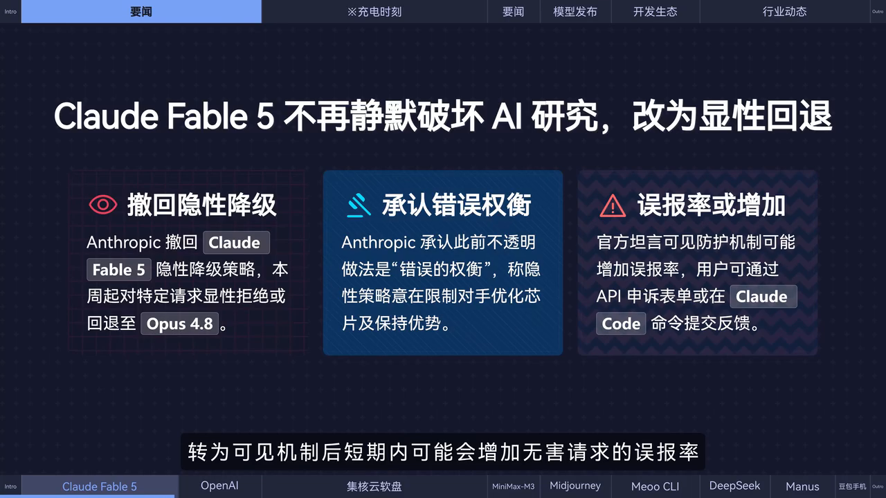

Anthropic 撤回了对 Claude Fable 5 模型**对大模型开发相关请求进行静默破坏的策略**，承认此前不透明的做法是错误的权衡。

从本周起，相关防护机制**转为可见**：系统会明确拒绝这些请求，或显示回退至较弱的 OP4.8 模型；API 端也会返回具体原因。官方坦言，转为可见机制后，短期内可能会增加无害请求的误报率。

---

### 第 2 页 · 00:30 - 00:41

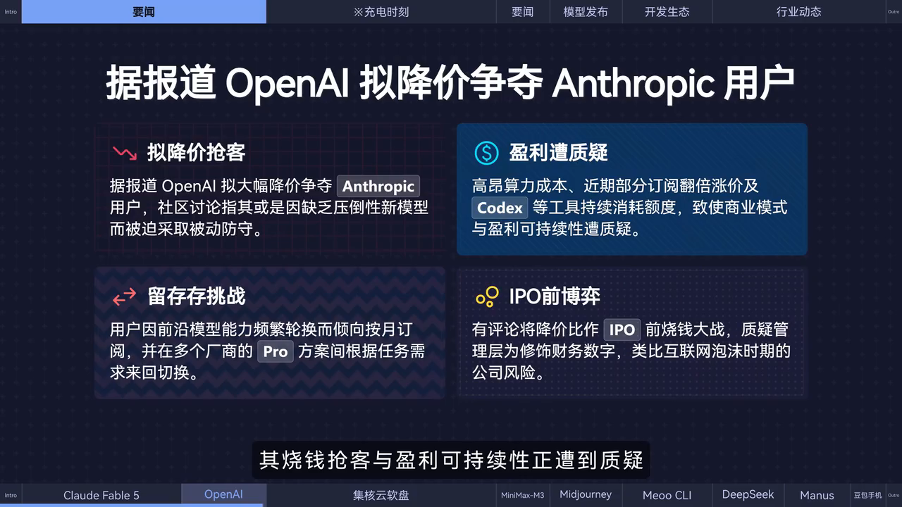

据报道，OpenAI **大幅降价**以争夺 Anthropic 等对手的用户。有社区讨论指出，这或是缺乏压倒性信心模型的**被动防守**。其烧钱抢客与盈利可持续性正遭到质疑。

---

### 第 3 页 · 00:45 - 00:49

> ⚠️ 以下为口播广告内容（集核云软盘），非资讯正文。

---

### 第 4 页 · 00:52 - 00:56

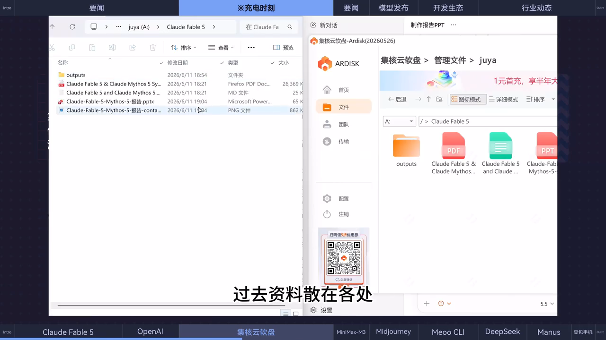

> ⚠️ 广告内容：集核云软盘——在电脑上生成本地原生磁盘，过去资料散在各处。

---

### 第 5 页 · 00:56 - 01:00

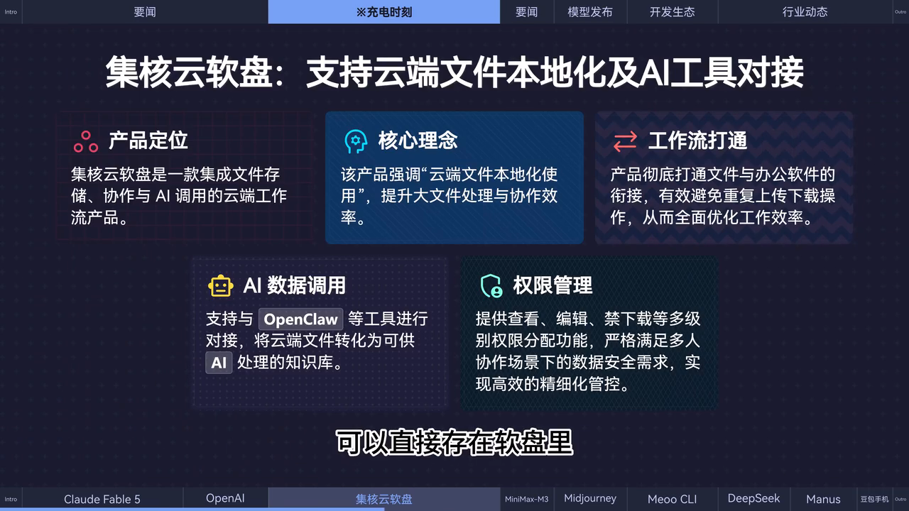

> ⚠️ 广告内容：所有高价值资料可直接存在软盘里，所有设备实时同步。

---

### 第 6 页 · 01:05 - 01:07

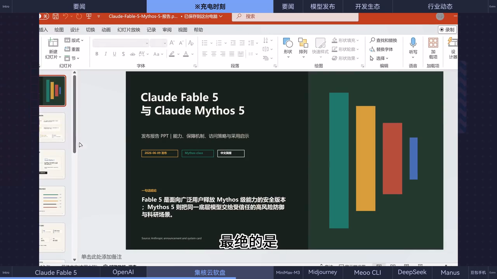

> ⚠️ 广告内容：移动办公无需下载资料，双击直接编辑，支持 AI Agent 调用网盘资料。

---

### 第 7 页 · 01:07 - 01:11

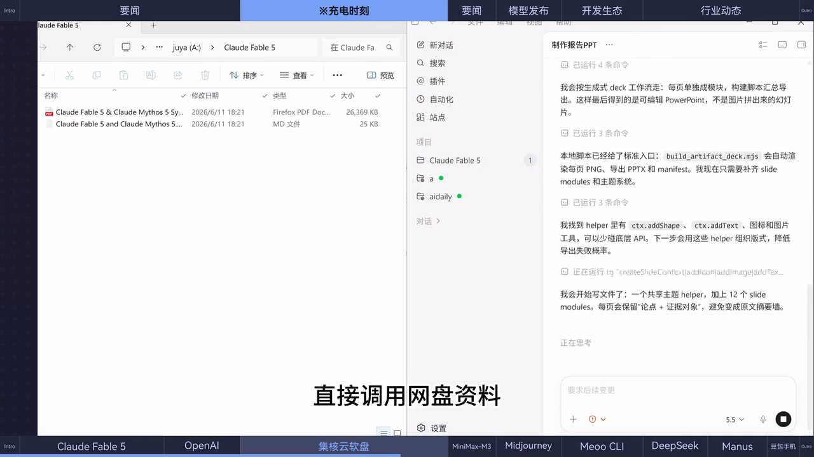

> ⚠️ 广告内容：AI Agent 可直接调用网盘资料，让 AI 帮你分析、总结。

---

### 第 8 页 · 01:15 - 01:17

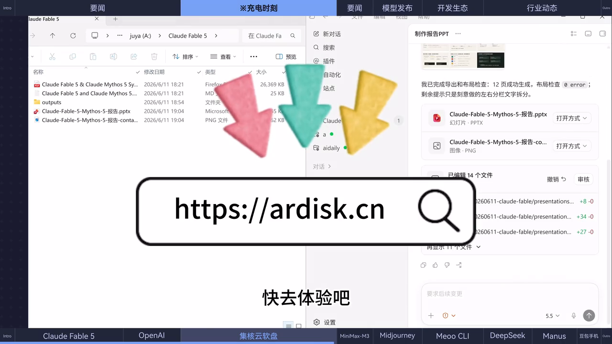

> ⚠️ 广告内容结束。零散资料秒变数据中心，注册免费试用。

---

### 第 9 页 · 01:17 - 01:25

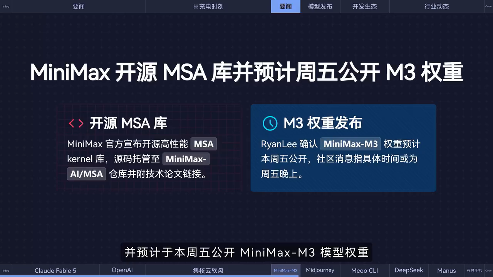

MiniMax 官方宣布**开源其高性能 MSA Kernel 库**，并预计于本周五公开 **MiniMax M3 模型权重**。

---

### 第 10 页 · 01:25 - 01:37

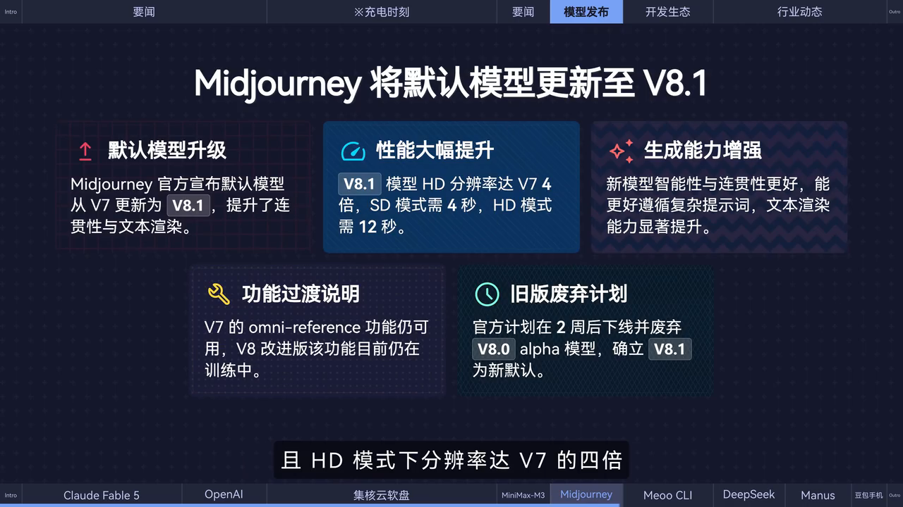

Midjourney 官方宣布默认模型已从 V7 更新为 **V8.1**。官方称新模型提升了**连贯性与文本渲染能力**，且 HD 模式下分辨率达 V7 的 **4 倍**。

---

### 第 11 页 · 01:37 - 01:43

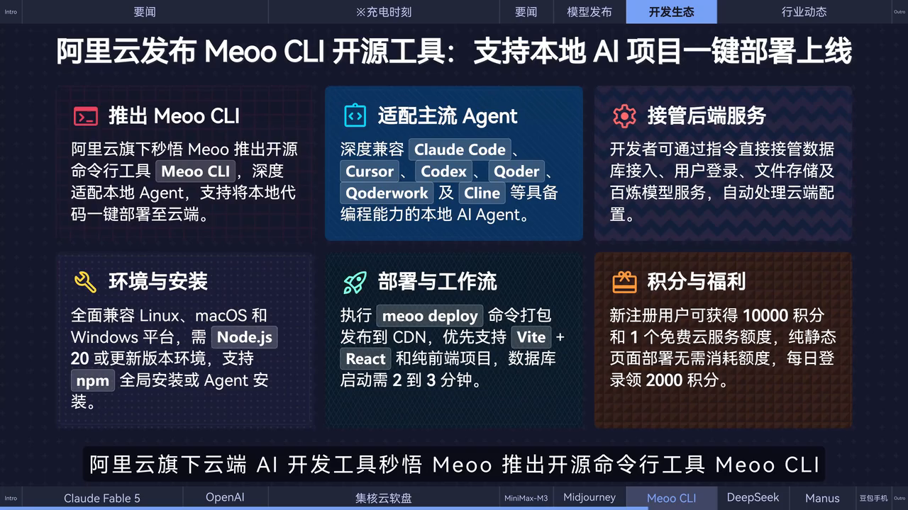

阿里云旗下云端 AI 开发工具**秒悟 Mio**推出开源命令行工具 **Mio CLI**。

---

### 第 12 页 · 01:47 - 01:51

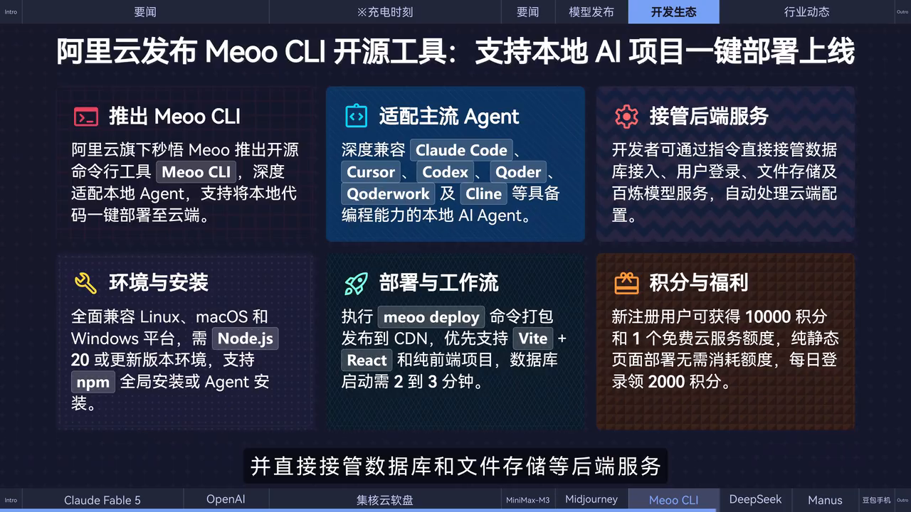

Mio CLI 支持将本地生成的代码**一键部署至云端**，并直接接管数据库和文件存储等后端服务。

---

### 第 13 页 · 01:51 - 01:55

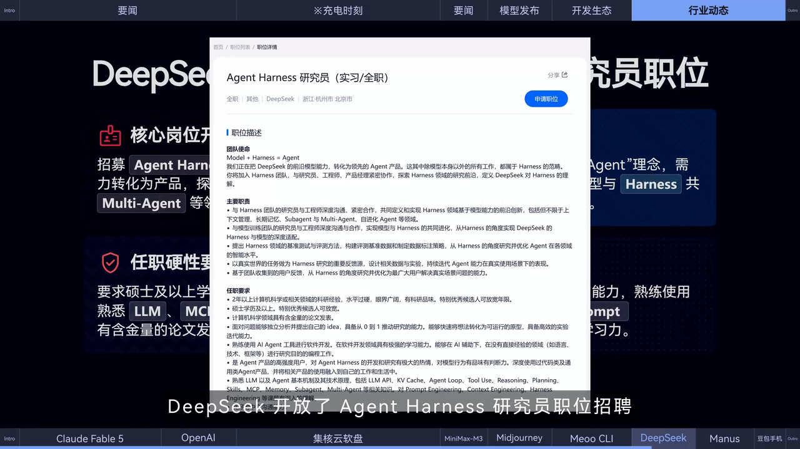

DeepSeek 开放了 **Agent Harness**，同步招聘研究员，旨在探索**上下文管理、Multi Agents** 等前沿领域。

---

### 第 14 页 · 02:00 - 02:02

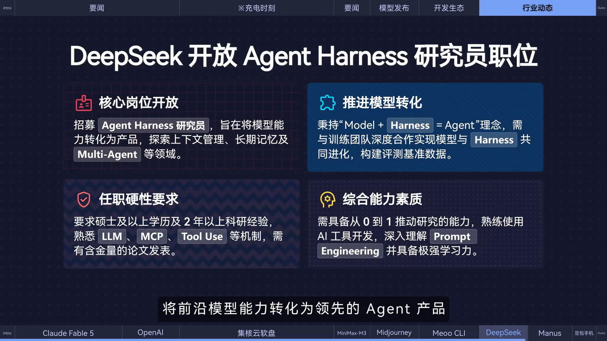

目标：将前沿模型能力转化为**领先的 Agent 产品**。

---

### 第 15 页 · 02:02 - 02:12

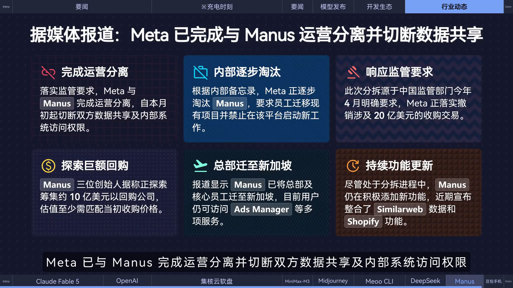

据媒体报道，为落实中国监管部门撤销收购案的要求，**Meta 已与 Manus 完成运营分离**，并切断双方数据共享及内部系统访问权限。

---

### 第 16 页 · 02:15 - 02:20

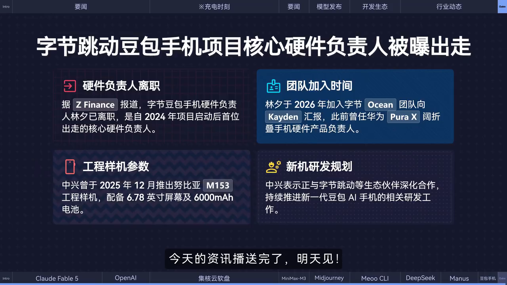

据 ZFinance 报道，字节跳动豆包手机硬件产品负责人**林希已离职**。

## 思维导图

